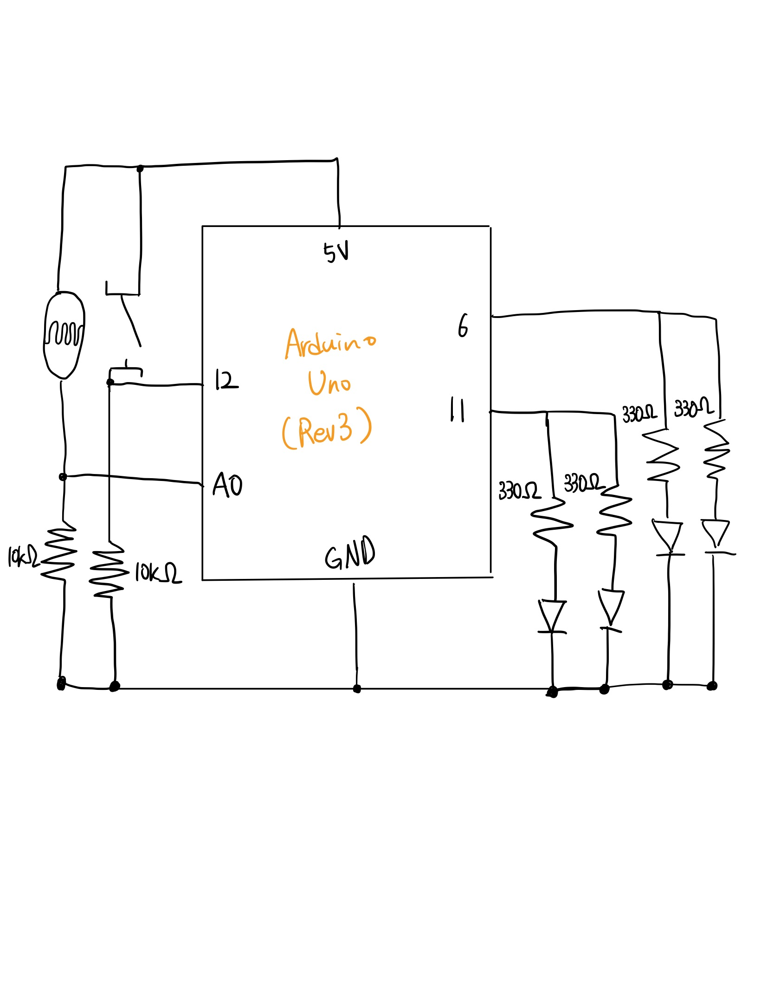

## 🎄🔴🟢 Digital Christmas Tree

***Digital Christmas Tree***

Description: Digital Christmas tree for happy early Christmas

- Schematics

- Work Process
  - Connected two analog input pins to each red LEDs and green LEDs and tested if it worked
  - Connected digital read switch on another pin
  - Connected an LDR pin to give variation to the blinking pattern according to the light

- Difficulties & Experiments
  -  Deciding where to put the registers was the hardest part since I am using lots of input and output devices.
  -  Integrating digital and analog input in one circuit was a new challenge but gave me a chance to try implementing more dynamic movement in my circuit ! 
