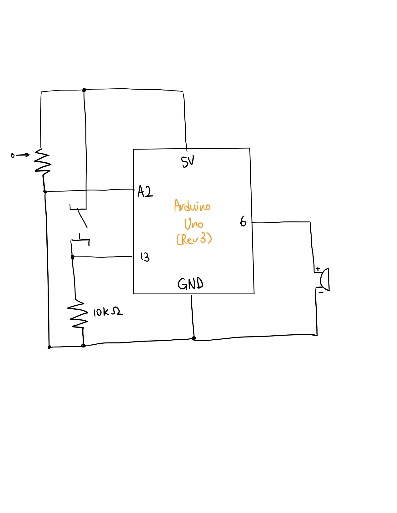

## 🐉 Ghibli Soundtrack Player

https://user-images.githubusercontent.com/68997923/142238751-7b21efe2-c2af-4450-80b6-c2fb200dba04.MOV

***Ghibli Soundtrack Player***

Description: Ghibli sountrack player that plays different Studio Ghibli sountracks depending on the angle of potentiometer

- Schematics

- Work Process
  - Built a circuit with a switch and a piezo buzzer and made the buzzer play sound when the switch is pushed
  - Typed in the melody and duration of two songs from different Studio Ghibli movies (My Neighbor Totoro, Spirited Away), referring to the pitch.h library
  - Tuned the note and delay durations to make the songs sound more natural 
  - Added a potentiometer on the circuit and song changing feature depending on the angle of the potentiometer. If a potentiometer arrow is on one half, it plays one song and if it's on the other half, it plays the other.

- Difficulties & Experiments
  -  Manually typing in each note of the songs took the most time but was really rewarding when I heard the final melody.
  -  Assigning right numbers to each delay() function to make each note sound after one another was the hardest part. I referred to the [Arduino Melody example](https://www.arduino.cc/en/Tutorial/BuiltInExamples/toneMelody) to find the right duration for each note.
