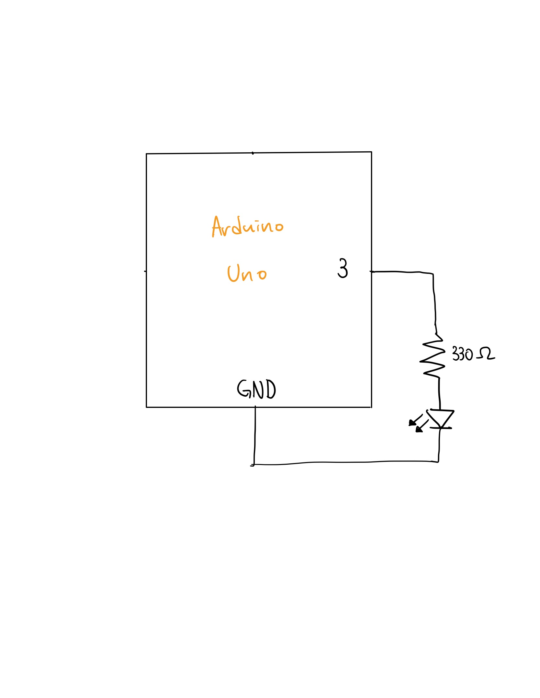
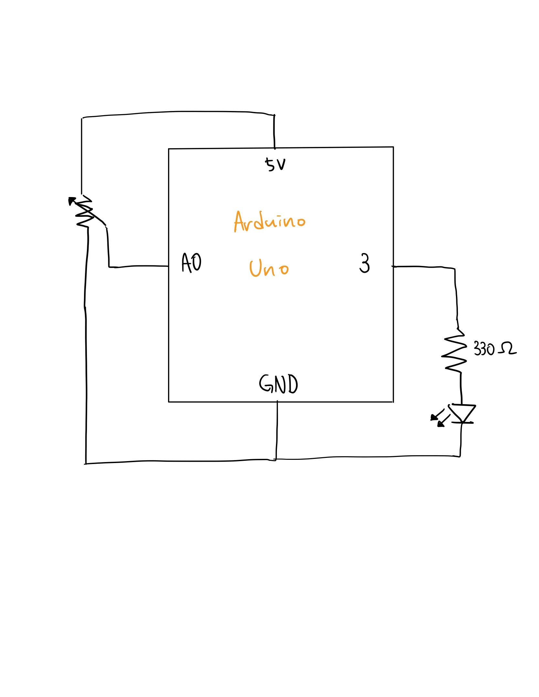

## Task 1. Move ellipse in Processing with Arduino analog sensor

https://user-images.githubusercontent.com/68997923/142624146-4dfbef7d-ceae-4b14-9937-0a0fec7a6d08.MOV

Description: Move an ellipse horizontally in Processing according to Potentiometer in Arduino circuit

- Schematics

- Work Process
  - Built a simple circuit in Arduino with a potentiometer
  - Wrote Processing program that changes ellipse x position according to the sensor value from Arduino
  - Wrote Arduino program that sends potentiometer value to the serial port

- Difficulties & Experiments

## Task 2. LED switch in Processing that controls LED in Arduino circuit

https://user-images.githubusercontent.com/68997923/142625406-e7d21871-8377-4053-bec6-cc26bac0cb42.MOV

Description: LED switch in Processing that controls LED in Arduino circuit

- Schematics

- Work Process
  - Built a simple circuit in Arduino with a potentiometer
  - Wrote Processing program that changes ellipse x position according to the sensor value from Arduino
  - Wrote Arduino program that sends potentiometer value to the serial port

- Difficulties & Experiments

## Task 3. Turn on & off LED and Wind control with Arduino analog sensor

https://user-images.githubusercontent.com/68997923/142625531-08967faa-cc98-452c-8b02-eeb05c0b2761.mov

Description: Move an ellipse horizontally in Processing according to Potentiometer in Arduino circuit

- Schematics

- Work Process
  - Built a simple circuit in Arduino with a potentiometer
  - Wrote Processing program that changes ellipse x position according to the sensor value from Arduino
  - Wrote Arduino program that sends potentiometer value to the serial port

- Difficulties & Experiments
  -  
