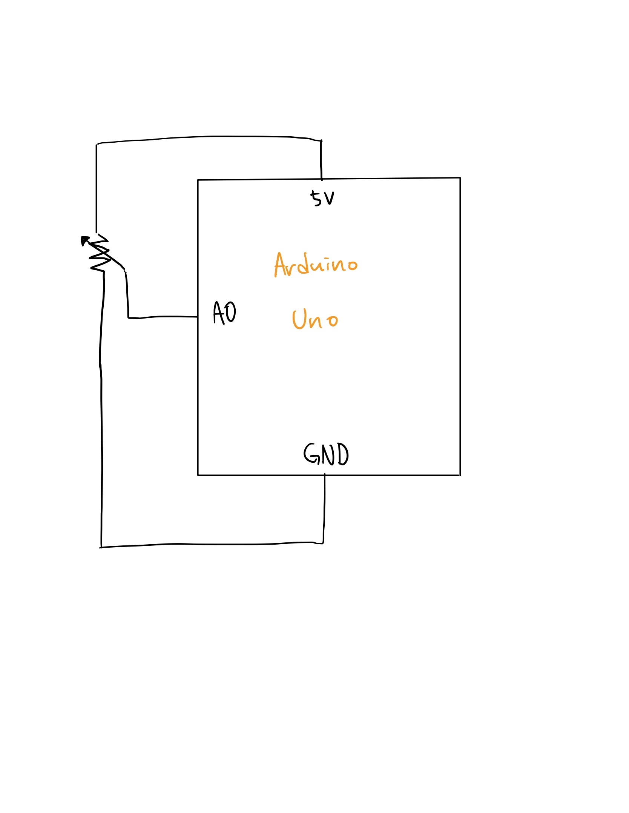

## Task 1: Move ellipse in Processing with Arduino analog sensor

Description: Move an ellipse horizontally in Processing according to Potentiometer in Arduino circuit

- Schematics

- Work Process
  - 

- Difficulties & Experiments
  -  
