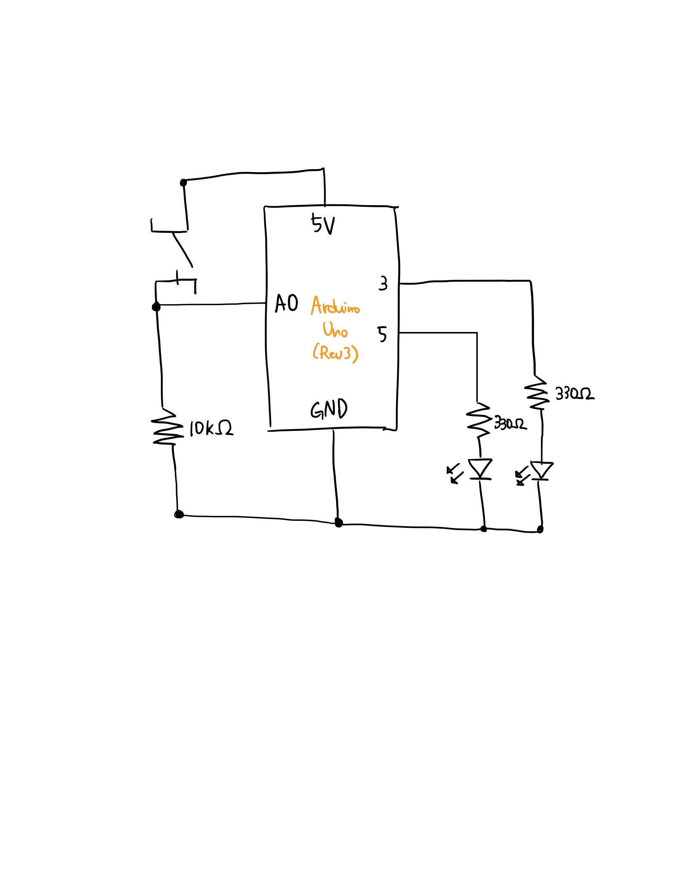

## 😼 Meow Switch

https://user-images.githubusercontent.com/68997923/140232082-5929fdc5-b40e-4950-8471-d924e057046b.mov

***Meow Switch***

Description: Creative Switch with Two Stuffy Cats for Arduino

- Equipments
    - Arduino kit
    - Stuffed cats
    - Copper tape
    - Insulating tape

- Schematics

- Work Process
  - Built a circuit with a switch and two LEDs
  - Made a cat switch using copper tape and insulating tape on stuffed cats
  - Connected the switch and the circuit by attaching the wire to the copper tape on each stuffed cat

- Difficulties & Experiments
  -  Building the accurate circuit was the hard part. Had several errors while connecting the switch to the circuit since I did not connect it in the right space.
  -  The biggest challenge was to decide where to place the other end of the wires that function as a switch. For the regular switches we used in our class, the row was separated naturally by its design. Got an error with random 0s and 1s in serial print, because I forgot to place the different ends of the switch on separate rows. Solved it by moving one of the ends to the other half of the breadboard, and making the connection work through the cat switch.
