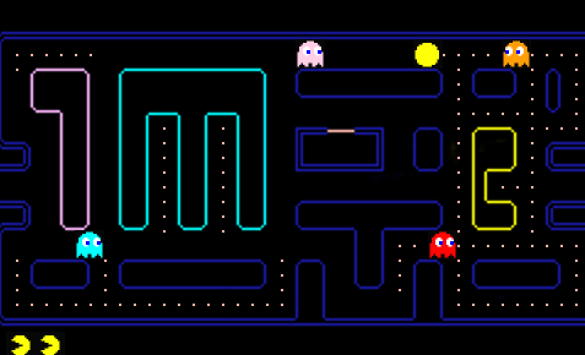

## IM PAC-MAN (<

***IM PAC-MAN (2021)***

Description: Customized PAC-MAN clone game with a theme dedicated to the Interactive Media department of NYU Abu Dhabi

- Work Process
  - Drew pixel-art maze using Procreate on iPad
  - Added variables and function to each class
  - Used Game class to handle the overall logic of the game
  - Added image animations, sound effects, and fonts

- Difficulties & Experiments
  -  The biggest difficulty was to make the chracters only move around the valid area of the maze.
  -  First tried using coordinate-based logic by calculating the distance between each element but failed.
  - Instead, used grid-based system, referred to the famous [Pac-Man Dossier](https://www.gamasutra.com/view/feature/3938/the_pacman_dossier.php?print=1) article.

- Reference
  - Original PAC-MAN (1980) by Bandai Namco Entertainment
  - [The Pac-Man Dossier](https://www.gamasutra.com/view/feature/3938/the_pacman_dossier.php?print=1) by Jamey Pittman