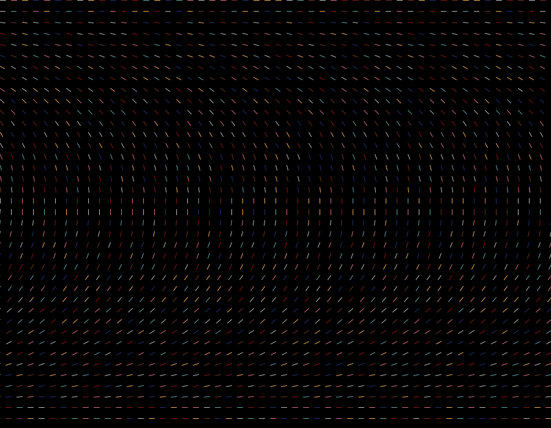

## 🌃 Loop Art Using Processing

***City,*** 2021

Medium: Digital Art

Dimension: 900 x 700 pixels

Description: Portrayal of ever-lasting city lights

- Work Process
  - Came up with color palette using Adobe Color
  - Generated static grid with different degrees for each row
  - Added rotation feature
  - Exported as gif using saveFrame()

- Difficulties & Experiments
  -  To amplify the dynamics and playfulness of the artwork, I tried experimenting with the speed of rotation and the angle of each rows.
  -  I used cos() and sin() functions to draw each line according to its assigned angle.
  -  To export the output as a gif, I saved each frame by saveFrame() and converted the images into gif at Exgif.com.

- Reference
  - Tyler Hobbs' Essay about Flow Fields (https://tylerxhobbs.com/essays/2020/flow-fields)
  - Color scheme inspired by Henri Matisse's 1911 painting, *The Pink Studio*
