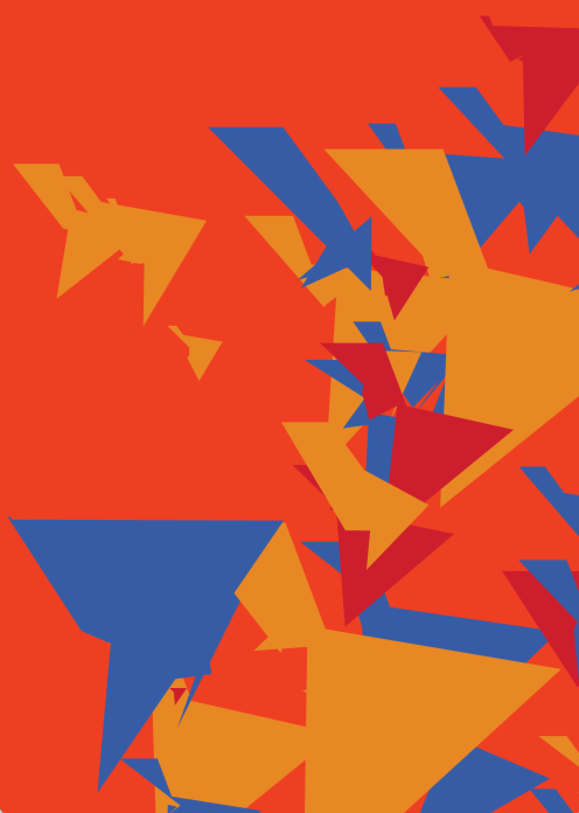
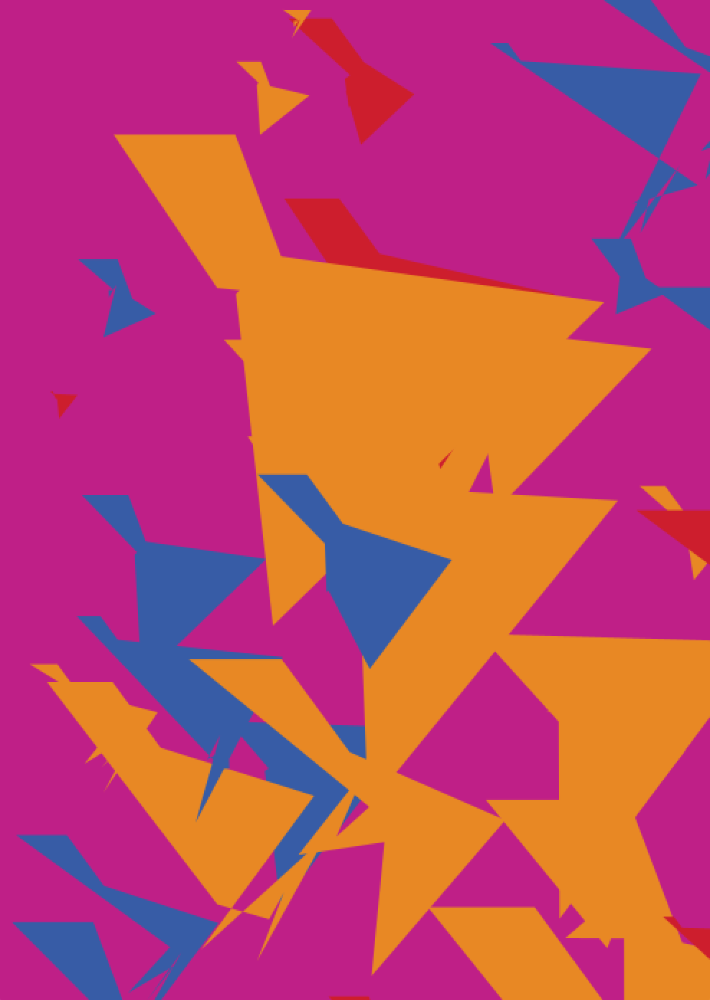

## 🔻🔹🔸 Generative Art Using Processing

***Shape Study***

Medium: Generative Art

Dimension: 500 x 700 pixels

Description: Geometric Shape Experiment in Processing. Inspired by Henri Matisse's paintings

- Work Process
  - Came up with color palette using Adobe Color
  - Added Star class that generates each star shape
  - Used translate() and rotate() to get each coordinate of spikes of a star shape

- Difficulties & Experiments
  -  The biggest difficulty was to generate each dynamic star shape in an aesthetically pleasing way.
  -  Tried using beginShape() & endShape() to generate my own shape but more accurate mathmetical calculation must be needed for more dynamic composition.

- Reference
  - Iconic Star Shapes in Henri Matisse's paintings
