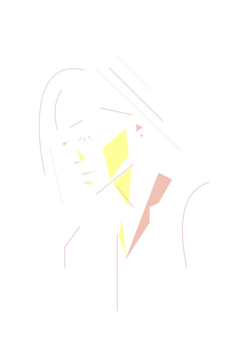

## Self Portrait Using Processing

This is the self portrait I made using Processing :

- Work Process
  - Sketch using Illustrator
  - Draw each shape in Processing referring to coordinates in Illustrator

- Hardships & Lessons
  - As it was relatively easy to arrange shapes in Processing thanks to the detailed sketch in Illustrator, manually typing in each coordinate took lots of time.
  - Drawing curves in Processing was harder than drawing other shapes since I had to guess the number to get the right degree of curves. However, as I repeated the process, I became used to it and was able to draw each curve faster and faster.
