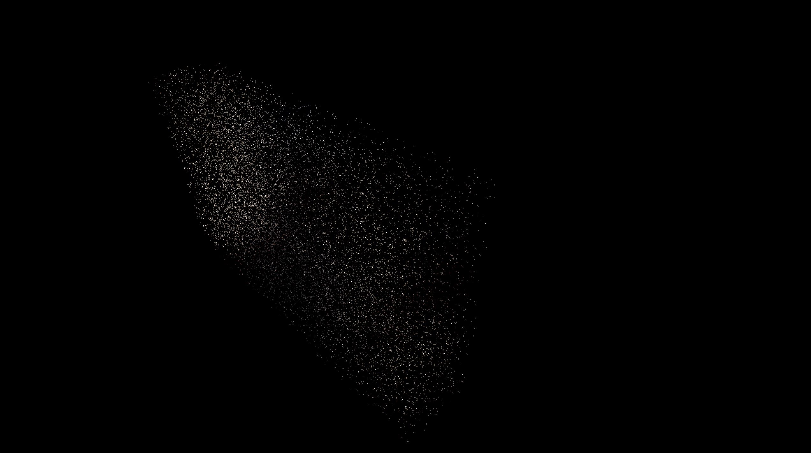
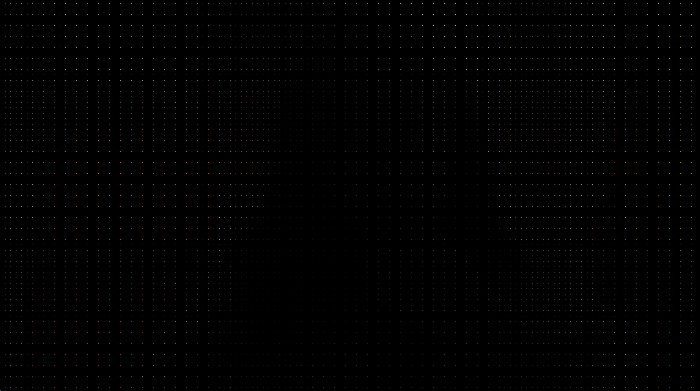
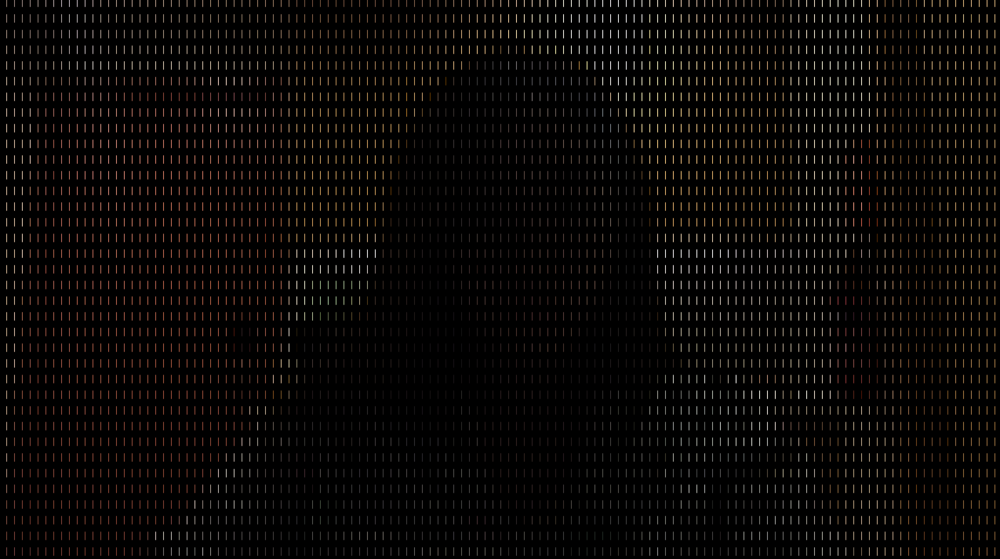

# Final Project Prompt

#### Concept
Generative artwork with the theme of light & space with Processing using user input from Arduino photo resister.

Inspiration (the exhibition I have visited in [Arte Museum, South Korea](https://artemuseum.com/)) :

#### Arduino
Arduino program will allow users to control the graphic/animation generated from Processing using photo resister as analog input. The program will send the light information to the Processing program and also visualize the brightness of the input light with LEDs using digital output. ( + Arduino program might also play interesting background music with digital output. )

#### Processing
If the light is bright, Processing program will present animation inspired by the bright space scape. As the light gets deemer, the graphic will change accordingly.

#### Challenges
Trickiest & most essential part will be to make dynamic and interesting random-generated graphic on Processing. To achieve this, I plan to research other generative artworks and experiment to find the interesting graphic.

# DEC. 7th
### Biggest Challenge:
My initial plan was to use **live video captures** of audiences from cameras and use them to generate 3D graphics to make the piece more interactive & interesting. The problem was that Processing doesn't yet allow to use video capture when using other renderers (OPENGL which I need for 3D Graphic) than default! I tried almost every possible ways that I could imagine & find from internet but haven't found a solution yet. Here are some methods I tried:
- Using video.start() and video.stop() to restart and stop video capturing everytime I need to capture a new image.
- Using hint() to enable and disable z-buffers
- Using PGraphic temporarily for 3D graphics
- Using separate Processing windows with PApplet

In the end, I gave up on using video capture and 3D in the same sketch and decided to use sample capture images that I got from my webcam during developing process. Later, I will try to get real time images from the camera using other ways than directly using Processing.

### Current Stage and Demos:
So I currently have two versions of Processing codes using **(1) static images with 3D graphics** and **(2) live video captures with 2D graphics**, but I am leaning towards the first version. 3D version adjusts depth of the dots based on the LDR sensor value.

- 3D Ver.

https://user-images.githubusercontent.com/68997923/144938448-a8eaa0c3-ad52-4cec-90d1-c7ed70f4fac2.mov

- Live Viedo Ver.

Using Dots

Using Lines

### Further Improvements:
My main goal for this project is to visualize the relationship between *light, time, and us* and come up with an interesting visualization that changes in real time based on two elements: the images of viewers and the amount of light coming into the LDR sensor. To achieve this, I think I will have to work more on following things before the deadline.
- Making rotation of the graphic smoother & automatic
- What should the **LDR sensor** do? Which value should it adjust? (currently decides depth)
- Obtaining real time images from the camera and figuring out how to connect/transition/layer from the previous image to the new one.
- How to make interaction between users and the LDR sensor more approchable and resillient (custom box that hides rest of the Arduino components and only shows the LDR sensor on the top?) or Adding some LEDs to make the Arduino board itself more visible and interesting
- Maybe some background musics to make it more immersive?

### Extra Equipments:
- Kinetic ?
- Large Screen
- LDR box
